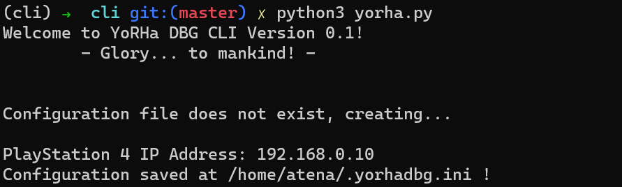
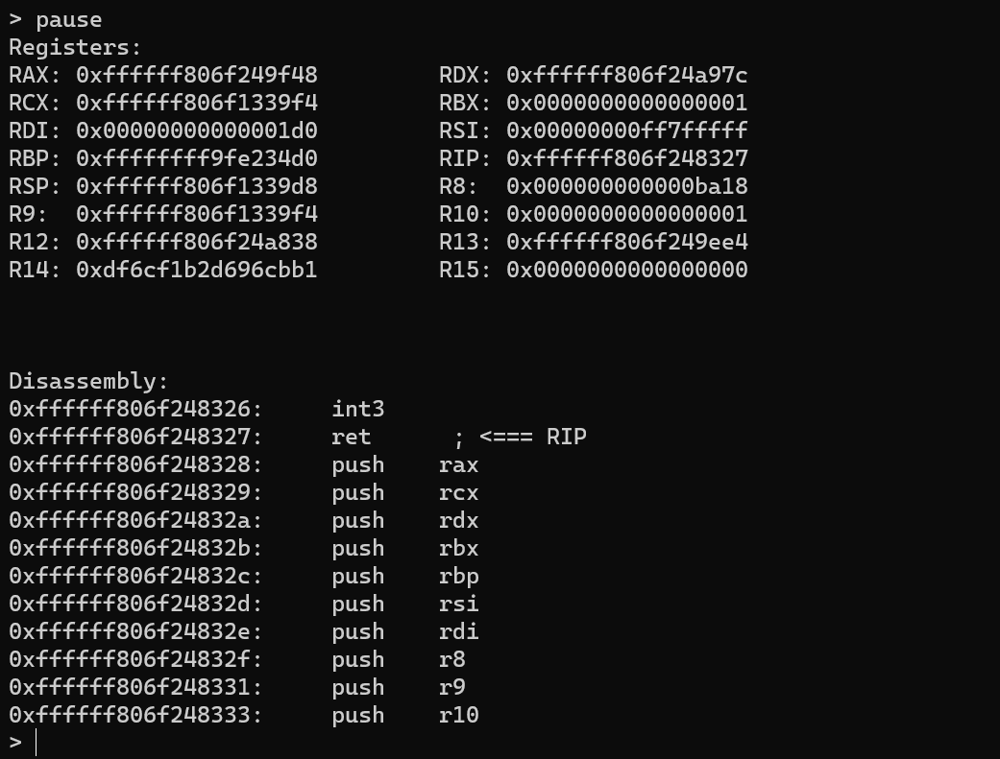
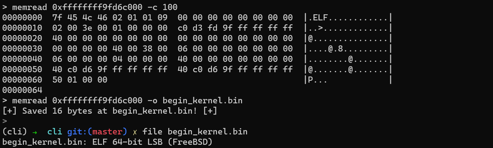
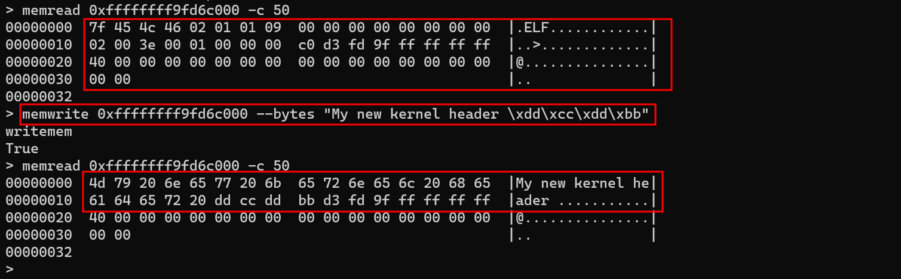
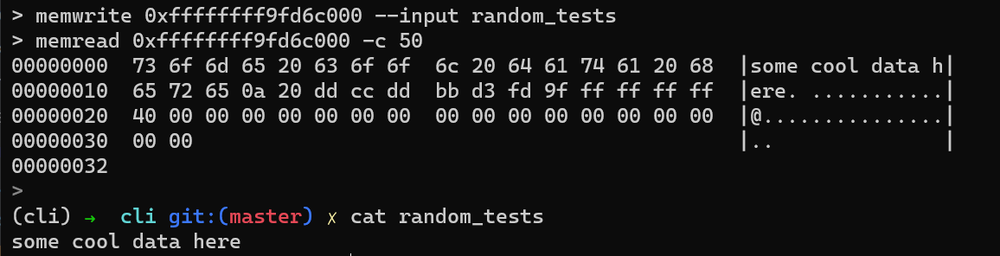
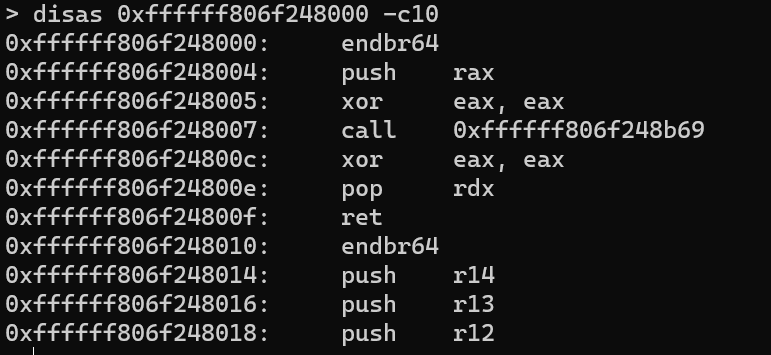
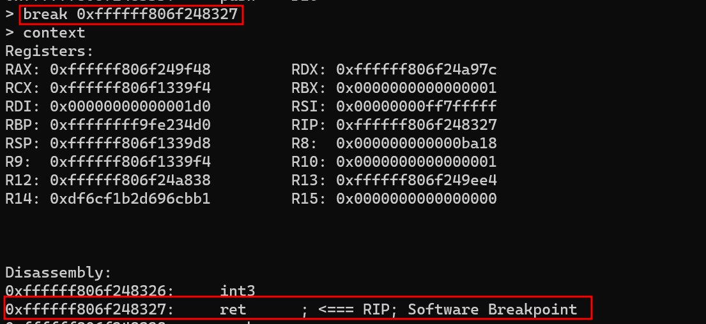
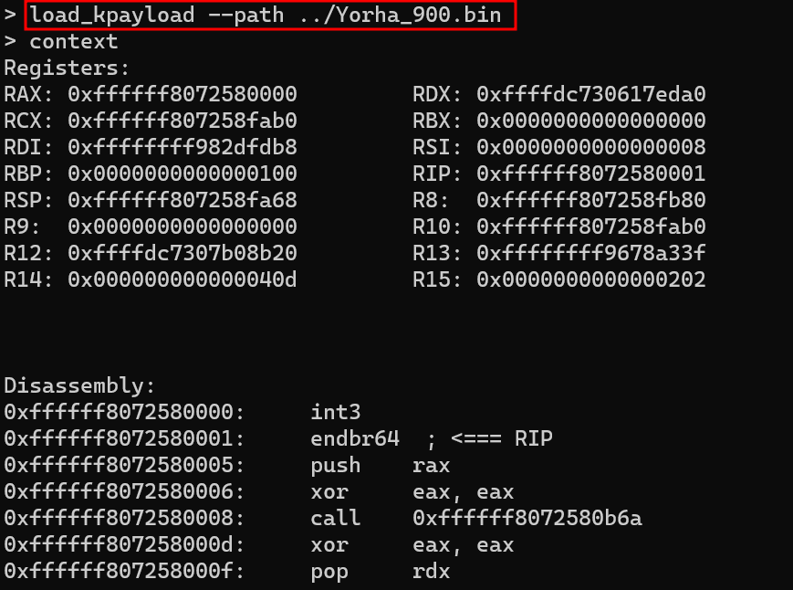
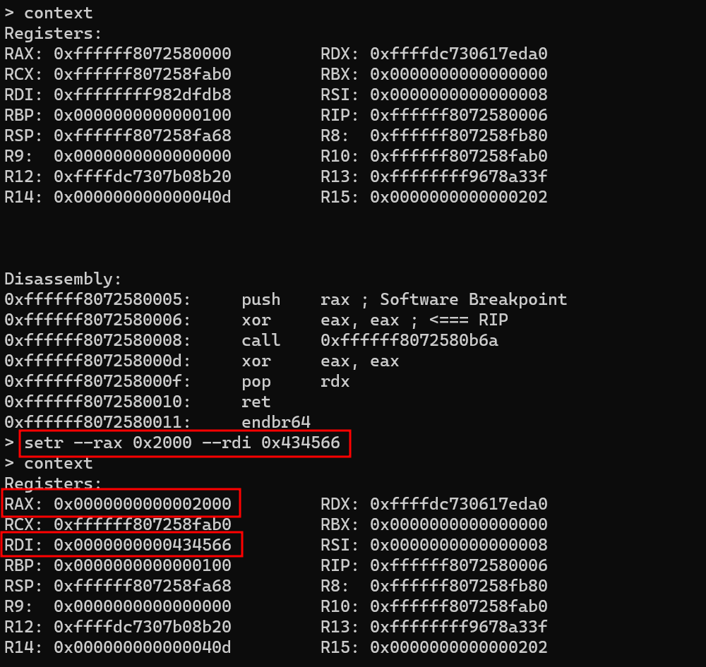

# YoRHa - PS4 KDebugger


YoRHa is a work-in-progress network kernel debugger for the PlayStation 4. It supports basic operations such as setting breakpoints, reading/writing memory, manipulating thread states and so on. This tool is especially useful for debugging kernel payloads, exploit development, and gaining a deeper understanding of the PS4 kernel's internals.

The debugger is designed to run in kernel mode on firmware version 9.0, requiring a kernel payload loader, such as Mira, to execute the payload at the kernel level.

## Capabilities:

The currently supported commands are fairly straightforward:

- memread
    - Reads N bytes from a specified memory area and displays the result as a hexdump or saves it to disk.
- memwrite
    - Writes N bytes to a specified memory area.
- break
    - Sets a software breakpoint (int3) at a given address.
- breakdel
    - Removes a previously set software breakpoint.
- pause
    - "Pauses" the current YorhaDBG thread to trigger the trap handler.
        - Note: The system is not entirely frozen, as some network components would not work.

- load_kpayload
    -  Loads a kernel payload and attach the debugger into it

- context
    - Displays the current state of the paused or trapped thread (from a breakpoint).
- setr
    - Modifies the registers of the currently stopped thread.

## Use cases & why

I specifically built this debugger to gain a deeper understanding of PS4/FreeBSD internals and to debug and unpack private HEN payloads, such as GoldHEN. While there are other projects like [Ring0GDB](https://github.com/m0rph3us1987/triggerRING0) that create a GDB stub, allowing the use of any tool compatible with the GDB protocol, I wanted to design my own protocol and functionality.

This debugger can be used to debug exploits, test kernel patches, and assist in kernel payload development.

## Supported firmware

The following firmware are currently supported:
* Fw 9.0
* ...

## Porting

Porting the debugger is fairly straightforward, as the only firmware dependencies are the offsets, which can be found in the `include/firmware/` directory. Refer to [fw900.h](include/firmware/fw900.h) as an example. After adding support for a new firmware version, it's important to update the [offset.h](include/firmware/offset.h) header accordingly.


# Installing 

## Compiling

When I first started writing the debugger, I used the ps4sdk project to build it. However, now you can build it simply using ***make***

1 - Clone the repository and the dependencies

>git clone --recursive https://github.com/buzzer-re/YoRHa.git

2 - Compile it

>make clean && make FIRMWARE=900

The payload will be generated as ```Yorha_900.bin```.


## How it works

During YoRHa's initialization, it overwrites call gate 3 of the IDT with a custom handler, enabling it to manage breakpoint events within the system. YoRHa operates on two different ports: a controller port on 8887 and a debugger port on 8888. The controller port remains functional even when a thread is trapped.


## Installing

As mentioned earlier, to use the debugger, the payload must first be loaded in kernel mode. I highly recommend using [Mira](https://github.com/OpenOrbis/mira-project) "CFW", as it provides enhanced debugging capabilities, including the ability to read log messages (port ***9998***) and a kernel module loader on port ***9025***. If Mira is not a option for you, I recommend the [Kameleon](https://www.kmeps4.site/900/kme900mfull/index.html) exploit host with the ***BinLoader-9021*** payload. Just send the ***Yorha.bin*** to some of them, and it will start to listen on port ***8887***

At this moment, YoRHa can't be loaded by usermode binloaders, but future versions will have the ability to be loaded this way (like GoldHEN) and migrate to kernel mode.


# Using the CLI

I’ve developed a simple CLI tool to interact with the debugger. While this tool is not intended to be the final version—since I plan to build a GUI application for it—it is still quite useful and straightforward to use. The source code is available in the `cli/` folder, and you can easily install it using `pip`.

> pip install yorha


## Connecting

Upon its first use, YoRHa will create a simple configuration file that includes your PS4 host address:



The configuration file will be placed in `~/.yorhadbg.ini`. Once the config file is created, you are ready to connect.


## Pause

The first useful command is `pause`, which traps the debugger at a software breakpoint and transfers control to the trap handler callgate. Once the debugger is in a paused state, you can inspect the current thread state, set breakpoints, and perform other actions. Immediately after executing the pause command, it internally issues the `context` command.



## Context

As the name suggests, the context command provides information about the current thread state, including register values and a disassembly of the current code. The output is the same as that of the `pause` command, as context implicitly invokes pause.


## Memread

With `memread`, things start to take shape. This command allows you to read memory contents and includes modifiers for dumping data to disk or displaying it as a hexdump. The available modifiers are:

- --output, -o
    - Save the output to a file.
- --count, -c
    - Specify the number of bytes to read.




## Memwrite

With `memwrite`, you can write data to a memory area. You can either specify the data directly on the command line or load it from a file on your disk. The available modifiers are:

- --bytes, -b
    - Write the contents directly from the CLI. Use the `\x41\x42` notation for raw bytes, and you can combine both notations if needed.
- --input, -i
    - Write the contents of a file to a specified address.


Writing data directly from the terminal:




Writing data from a disk file:

||
|:--:|
| Write data from a file |

## Disas

With `disas`, you can disassemble instructions starting from a given address. The available modifier is:

- --count, -c
    - Specifies the number of ***instructions*** to display.




## Breakpoint

With the `break` command, you can set a breakpoint at a specified memory address. If you are already stopped at a breakpoint, you can use the `continue` command to resume execution:



To delete a breakpoint, use the `breakdel` command with the address as an argument.


## Load kernel payload

You can load a kernel payload using the `load_kpayload` command with the `--path` argument, specifying the path to the payload on disk. YoRHa will load the payload and stop at its entry point, allowing you to debug it easily:




## Set thread state

You can modify the current thread's registers using the `setr` command, specifying the register you want to modify as an argument. For example:

>setr --rax 0x2000 --rdi 0x434566



Any unused registers will remain unchanged.

# Future features

he debugger is missing a few commands, such as `single-step`, but these will be implemented in the near future. I developed all the existing commands based on my needs during reverse engineering activities and will continue to add features as required.


# Conclusion

As I wrote before, I did this project to learn more about how the PS4 works and to improve my console hacking skills. There are many cool features to explore and to extract from my research on it that apply to both PS4 and PS5. I would like to thank the following projects and resources that helped me a lot:

- [Mira](https://github.com/OpenOrbis/mira-project)
    - I read extensively the source code of this amazing project. It's a very good resource to study and improve. It also contains the source code of the Ring0GDB.

- [PPPWn](https://github.com/TheOfficialFloW/PPPwn/)
    -  The PPPWn exploit source code is also a good resource for reading, from the exploitation side of things, but the payload source code is quite interesting to read, especially forks like the [LightningMods](https://github.com/LightningMods/PPPwn/tree/master/stage2) one.

- [PSDevWiki](https://www.psdevwiki.com/)
    - There are a lot of good materials on this wiki that I've extensively used.

- [OpenOrbis](https://github.com/OpenOrbis)
    - The OpenOrbis community contains a lot of materials and curated FreeBSD headers to work with. It's an amazing resource.


-- That's all --

